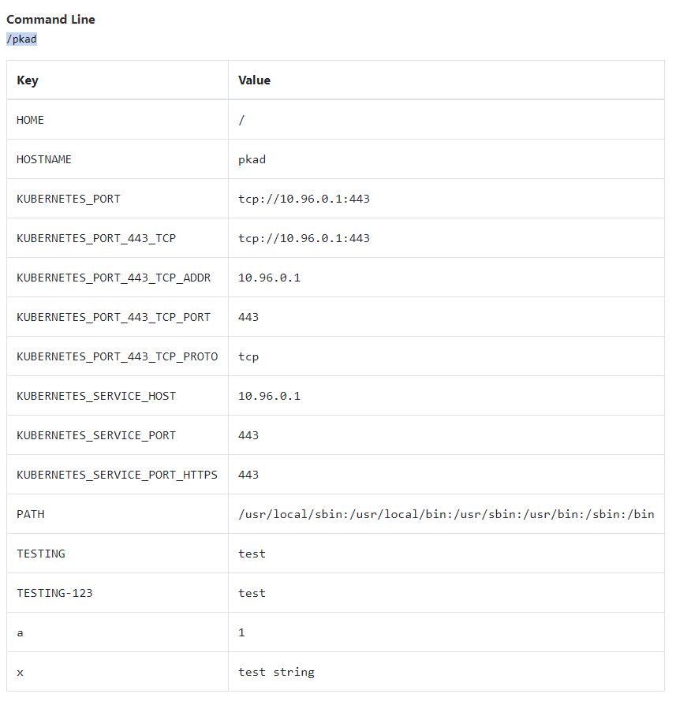

# ConfigMap – Ćwiczenia

## Praca z ConfigMap
## 1. Stwórz ConfigMap wykorzystując kubectl
### 1.1 Załącz do niej przynajmniej dwie proste wartości (literal)

```
> kubectl create configmap cw1 --from-literal=a=1 --from-literal=x='test string'
configmap/cw1 created

> kubectl get configmap cw1 -o yaml
apiVersion: v1
data:
  a: "1"
  x: test string
kind: ConfigMap
metadata:
  creationTimestamp: "2019-12-30T10:53:16Z"
  name: cw1
  namespace: default
  resourceVersion: "447871"
  selfLink: /api/v1/namespaces/default/configmaps/cw1
  uid: 95931049-2af2-11ea-aea1-00155d006a01
```

### 1.2 Załącz do niej klucz: 123_TESTING z dowolną wartością
```
> kubectl edit configMap cw1     
configmap/cw1 edited

> kubectl get configmap cw1 -o yaml
apiVersion: v1
data:
  123_TESTING: test
  a: "1"
  x: test string
kind: ConfigMap
metadata:
  creationTimestamp: "2019-12-30T10:53:16Z"
  name: cw1
  namespace: default
  resourceVersion: "448189"
  selfLink: /api/v1/namespaces/default/configmaps/cw1
  uid: 95931049-2af2-11ea-aea1-00155d006a01
```

### 1.3 Załącz do niej klucz: TESTING-123 z dowolną wartością
```
> kubectl edit configMap cw1     
configmap/cw1 edited

> kubectl get configmap cw1 -o yaml
apiVersion: v1
data:
  123_TESTING: test
  TESTING-123: test
  a: "1"
  x: test string
kind: ConfigMap
metadata:
  creationTimestamp: "2019-12-30T10:53:16Z"
  name: cw1
  namespace: default
  resourceVersion: "448302"
  selfLink: /api/v1/namespaces/default/configmaps/cw1
  uid: 95931049-2af2-11ea-aea1-00155d006a01
```

### 1.4 Załącz do niej klucz: TESTINGz dowolną wartością
```
> kubectl edit configMap cw1     
configmap/cw1 edited

> kubectl get configmap cw1 -o yaml
apiVersion: v1
data:
  123_TESTING: test
  TESTING: test
  TESTING-123: test
  a: "1"
  x: test string
metadata:
  creationTimestamp: "2019-12-30T10:53:16Z"
  name: cw1
  namespace: default
  resourceVersion: "448363"
  selfLink: /api/v1/namespaces/default/configmaps/cw1
  uid: 95931049-2af2-11ea-aea1-00155d006a01
```

## 2. Stwórz drugą ConfigMap wykorzystując kubectl
### 2.1 Załącz do niej dwie takie same klucze i ale różne wartości

```
> kubectl create configmap cw2 --from-literal=x=1 --from-literal=x=2 
error: cannot add key x, another key by that name already exists in data: map[x:1]
```

⚠️ Próba stworzenia ConfigMap z dwoma identycznyni kluczami zakończy się niepowodzeniem

### 2.2 Jeden plik normalnie
### 2.3 Oraz jeden plik z inną nazwą klucza niż nazwa pliku

```
> kubectl create configmap cw2 --from-literal=x=1 --from-file=config1.json --from-file=config2=config1.json
configmap/cw2 created

> kubectl describe configmap cw2 
Name:         cw2
Namespace:    default
Labels:       <none>
Annotations:  <none>

Data
====
config1.json:
----
{
    "json1": "aaa",
    "json2": 2,
    "json3": [1,2,3],
    "json4": {
        "json5": "xxx",
        "json6": ["a","b","c"]
    }
}
config2:
----
{
    "json1": "aaa",
    "json2": 2,
    "json3": [1,2,3],
    "json4": {
        "json5": "xxx",
        "json6": ["a","b","c"]
    }
}
x:
----
1
Events:  <none>
```

## 3. Stwórz trzecią ostatnią ConfigMapę wykorzystując kubectl
### 3.1 zrób tak by załączyć pliki o rozmiarach ~20KB, ~30KB, ~40KB i ~50KB

```
> fallocate -l 20KB 20KB.txt 
> kubectl create configmap cw3 --from-file=20KB.txt --from-file=30KB.txt --from-file=40KB.txt  --from-file=50KB.txt
configmap/cw3 created
```

## Wyeksportuj wszystkie stworzone ConfigMapy do yamli.

```
> kubectl get configmap cw1 -o yaml > cw1.yml
> kubectl get configmap cw2 -o yaml > cw2.yml
> kubectl get configmap cw3 -o yaml > cw3.yml
```

## Co się stanie gdy nadamy taki sam klucz? Czego Ty byś się spodziewał?
configMap nie zostanie swtorzony, szczerze mówiąc spodziewałem się że wartość zostanie nadpisana. Obecne podejście wydaję się jednak lepsze, nadpisanie wartości jest z reguły trudne do namierzenia.

## Czy można nadać dowolną nazwę klucza w ConfigMap?

jeżeli robimy to z poziomu `edit` nie ma problemu z używaniem `_`, `-`, ani cyfr na początku nazwy.

---
---


## Zmienne środowiskowe

Dla Poda możesz skorzystać z własnego obrazu lub z obrazu poznajkubernetes/pkad

```
kubectl run --restart=Never --image=poznajkubernetes/pkad pkad --dry-run -o yaml > pkad.yaml
```

### 1. Wczytaj wszystkie klucze z pierwszej ConfigMapy do Poda jako zmienne środowiskowe. Zweryfikuj dokładnie zmienne środowiskowe. Jaki wynik został uzyskany i dlaczego taki?

POD definition `pkad-cw1.yaml` po modyfikacjach `pkad.yaml`
```
apiVersion: v1
kind: Pod
metadata:
  creationTimestamp: null
  labels:
    run: pkad
  name: pkad
spec:
  containers:
  - image: poznajkubernetes/pkad
    name: pkad
    resources: {}
    envFrom:
      - configMapRef:
          name: cw1
  dnsPolicy: ClusterFirst
  restartPolicy: Never
status: {}
```

```
> kubectl apply -f pkad-cw1.yaml     
pod/pkad created
```

następnie sprawdzamy opis poda `pkad`. W `Events` zauważamy że jedna ze zmiennych nie mogła zostać zastosowana w zmiennych środowiskowych
> Warning  InvalidEnvironmentVariableNames - Keys [123_TESTING] from the EnvFrom configMap default/cw1 were skipped since they are considered invalid environment variable names.

```
> kubectl describe pod pkad 

...
Events:
  Type     Reason                           Age   From                     Message
  ----     ------                           ----  ----                     -------
  Normal   Scheduled                        23s   default-scheduler        Successfully assigned default/pkad to docker-desktop
  Normal   Pulling                          22s   kubelet, docker-desktop  Pulling image "poznajkubernetes/pkad"
  Normal   Pulled                           20s   kubelet, docker-desktop  Successfully pulled image "poznajkubernetes/pkad"
  Warning  InvalidEnvironmentVariableNames  20s   kubelet, docker-desktop  Keys [123_TESTING] from the EnvFrom configMap default/cw1 were skipped since they are considered invalid environment variable names.
  Normal   Created                          20s   kubelet, docker-desktop  Created container pkad
  Normal   Started                          20s   kubelet, docker-desktop  Started container pkad

```

dla potwierdzenia po wejsciu do aplikacji pkad widzimy że pozostałe zmienne z `cw1` zostały przepisane poprawnie



### 2. Wczytaj wszystkie klucze z trzeciej ConfigMapy do Poda jako zmienne środowiskowe. Zweryfikuj dokładnie zmienne środowiskowe. Jaki wynik został uzyskany i dlaczego taki?

POD definition `pkad-cw3.yaml` po modyfikacjach `pkad.yaml`
```
apiVersion: v1
kind: Pod
metadata:
  creationTimestamp: null
  labels:
    run: pkad
  name: pkad
spec:
  containers:
  - image: poznajkubernetes/pkad
    name: pkad
    resources: {}
    envFrom:
      - configMapRef:
          name: cw3
  dnsPolicy: ClusterFirst
  restartPolicy: Never
status: {}
```

```
> kubectl apply -f pkad-cw3.yaml     
pod/pkad created
```

zauważamy, że zmienne środowiskowe nie zostaly przypisane ze względu na złe nazwy kluczy 
> Warning  InvalidEnvironmentVariableNames  17s   kubelet, docker-desktop  Keys [20KB.txt, 30KB.txt, 40KB.txt, 50KB.txt] from the EnvFrom configMap default/cw3 were skipped since they are considered invalid environment variable names.

```
> kubectl describe pod pkad  

...
Events:
  Type     Reason                           Age   From                     Message
  ----     ------                           ----  ----                     -------
  Normal   Scheduled                        20s   default-scheduler        Successfully assigned default/pkad to docker-desktop
  Normal   Pulling                          18s   kubelet, docker-desktop  Pulling image "poznajkubernetes/pkad"
  Normal   Pulled                           17s   kubelet, docker-desktop  Successfully pulled image "poznajkubernetes/pkad"
  Warning  InvalidEnvironmentVariableNames  17s   kubelet, docker-desktop  Keys [20KB.txt, 30KB.txt, 40KB.txt, 50KB.txt] from the EnvFrom configMap default/cw3 were skipped since they are considered invalid environment variable names.
  Normal   Created                          17s   kubelet, docker-desktop  Created container pkad
  Normal   Started                          16s   kubelet, docker-desktop  Started container pkad
```

widzimy też że zmienne nie są ustawione w env variables

```
> kubectl exec pkad -- printenv 

PATH=/usr/local/sbin:/usr/local/bin:/usr/sbin:/usr/bin:/sbin:/bin
HOSTNAME=pkad
KUBERNETES_SERVICE_HOST=10.96.0.1
KUBERNETES_SERVICE_PORT=443
KUBERNETES_SERVICE_PORT_HTTPS=443
KUBERNETES_PORT=tcp://10.96.0.1:443
KUBERNETES_PORT_443_TCP=tcp://10.96.0.1:443
KUBERNETES_PORT_443_TCP_PROTO=tcp
KUBERNETES_PORT_443_TCP_PORT=443
KUBERNETES_PORT_443_TCP_ADDR=10.96.0.1
HOME=/
```

jeżeli podmienimy nazwy kluczy w definicji `POD`
```
apiVersion: v1
kind: Pod
metadata:
  creationTimestamp: null
  labels:
    run: pkad
  name: pkad
spec:
  containers:
  - image: poznajkubernetes/pkad
    name: pkad
    resources: {}
    env:
      - name: 'file20'
        valueFrom:
          configMapKeyRef:
            key: 20KB.txt
            name: cw3
      - name: 'file50'
        valueFrom:
          configMapKeyRef:
            key: 50KB.txt
            name: cw3
    envFrom:
      - configMapRef:
          name: cw3
  dnsPolicy: ClusterFirst
  restartPolicy: Never
status: {}
```
zmienne zostają poprawnie przepisane z config map
```
> kubectl delete pod pkad 
> kubectl apply -f pkad-cw3-improved.yaml
> kubectl exec pkad -- printenv
PATH=/usr/local/sbin:/usr/local/bin:/usr/sbin:/usr/bin:/sbin:/bin
HOSTNAME=pkad
file50=AAAAAAAAAAAAAAAAAAAAAAAAAAAAAAAAAAAAAAAAAAAAA
...
```

## Co ma pierwszeństwo: zmienna środowiskowa zdefiniowana w ConfiMap czy w Pod?

Zmienna środowiskowa zdefiniowana w `env` w `POD` zawsze nadpisze zmienną dostarczoną z `ConfigMap` przez `envFrom`

przykładowy `pkad-env-vs-envFrom.yaml` pokazujący co się stanie:
```
apiVersion: v1
kind: Pod
metadata:
  creationTimestamp: null
  labels:
    run: pkad
  name: pkad
spec:
  containers:
  - image: poznajkubernetes/pkad
    name: pkad
    resources: {}
    envFrom:
      - configMapRef:
          name: cw1
    env:
      - name: x
        value: 'from_pod_env'
  dnsPolicy: ClusterFirst
  restartPolicy: Never
status: {}
```

## Czy kolejność definiowania ma znaczenie (np.: env przed envFrom)?

tylko dla kolejności wpisania zmiennych do zmiennych środowiskowych (można posłużyc się `pkad-env-vs-envFrom.yaml` aby to sprawdzić)

## Jak się ma kolejność do dwóch różnych ConfigMap?

Jeżeli dwie konfigmapy stosują te same nazwy zmiennych to w environment variablach wartość zmiennej zostanie nadpisana przez ostatnią configMape. Przykłąd poniżej:

```
> kubectl create cm cw-a1 --from-literal=x=a1
configmap/cw-a1 created

> kubectl create cm cw-a2 --from-literal=x=a2
configmap/cw-a2 created
```
`pkad-cw-a1-and-cw-a2.yaml`:
```
apiVersion: v1
kind: Pod
metadata:
  creationTimestamp: null
  labels:
    run: pkad
  name: pkad
spec:
  containers:
  - image: poznajkubernetes/pkad
    name: pkad
    resources: {}
    envFrom:
      - configMapRef:
          name: cw-a1
      - configMapRef:
          name: cw-a2
  dnsPolicy: ClusterFirst
  restartPolicy: Never
status: {}
```
```
> kubectl apply -f pkad-cw-a1-and-cw-a2.yaml 
pod/pkad created

> kubectl exec pkad -- printenv  
PATH=/usr/local/sbin:/usr/local/bin:/usr/sbin:/usr/bin:/sbin:/bin
HOSTNAME=pkad
x=a2
...
```

---
---

## Wolumeny

### 1. Wykorzystując drugą ConfigMapę stwórz Pod i wczytaj wszystkie pliki do katalogu wybranego przez siebie katalogu

`pkad-cw2-volume.yaml`:
```
apiVersion: v1
kind: Pod
metadata:
  creationTimestamp: null
  labels:
    run: pkad
  name: pkad
spec:
  volumes:
    - name: cw2volume
      configMap:
        name: cw2
  containers:
  - image: poznajkubernetes/pkad
    name: pkad
    resources: {}
    volumeMounts:
      - name: cw2volume
        mountPath: /etc/config        
  dnsPolicy: ClusterFirst
  restartPolicy: Never
status: {}
```

```
> kubectl apply -f pkad-cw2-volume.yaml
> kubectl exec pkad -- ls /etc/config
config1.json
config2
x

> kubectl exec pkad -- cat /etc/config/config1.json
{
    "json1": "aaa",
    "json2": 2,
    "json3": [1,2,3],
    "json4": {
        "json5": "xxx",
        "json6": ["a","b","c"]
    }
}
```

### 2. Wczytaj do wolumenu tylko i wyłącznie pliki powyżej 30KB z trzeciej ConfigMapy

`pkad-cw3-30KB-volume.yaml`:
```
apiVersion: v1
kind: Pod
metadata:
  creationTimestamp: null
  labels:
    run: pkad
  name: pkad
spec:
  volumes:
    - name: cw3volume
      configMap:
        name: cw3
        items:
          - key: 30KB.txt
            path: 30KB.txt
  containers:
  - image: poznajkubernetes/pkad
    name: pkad
    resources: {}
    volumeMounts:
      - name: cw3volume
        mountPath: /etc/config        
  dnsPolicy: ClusterFirst
  restartPolicy: Never
status: {}
```

```
> kubectl apply -f pkad-cw3-30KB-volume.yaml
pod/pkad created

> kubectl exec pkad -- ls /etc/config
30KB.txt
```

### Co się stanie jak z mountPath ustawisz na katalog Twojej aplikacji?

w ten sposób nadpiszemy nasz katalog, kontener nie wstanie bo nie będzie miał czego uruchomić

`pkad-wrong-mountpath.yaml`:
```
apiVersion: v1
kind: Pod
metadata:
  creationTimestamp: null
  labels:
    run: pkad
  name: pkad
spec:
  volumes:
    - name: cw2volume
      configMap:
        name: cw2
  containers:
  - image: poznajkubernetes/pkad
    name: pkad
    resources: {}
    volumeMounts:
      - name: cw2volume
        mountPath: /pkad/
  dnsPolicy: ClusterFirst
  restartPolicy: Never
status: {}
```

```
> kubectl apply -f pkad-wrong-mountpath.yaml
> kubectl get pod pkad           
NAME   READY   STATUS               RESTARTS   AGE
pkad   0/1     ContainerCannotRun   0          2m7s

> kubectl get pod pkad -o yaml

...
state:
      terminated:
        containerID: docker://c0a8429b9ed34f70d586dc5bf8b0eed69517d397a06243d8935c8af40a6f8788
        finishedAt: "2019-12-30T13:15:22Z"
        message: 'OCI runtime create failed: container_linux.go:346: starting container
          process caused "process_linux.go:449: container init caused \"rootfs_linux.go:58:
          mounting \\\"/var/lib/kubelet/pods/6d9abd51-2b06-11ea-aea1-00155d006a01/volumes/kubernetes.io~configmap/cw2volume\\\"
          to rootfs \\\"/var/lib/docker/overlay2/71d7e584bc4b194f2f1d205e3fc7d12fcfffc64e58642f3532c8f8900a8d1382/merged\\\"
          at \\\"/var/lib/docker/overlay2/71d7e584bc4b194f2f1d205e3fc7d12fcfffc64e58642f3532c8f8900a8d1382/merged/pkad\\\"
          caused \\\"not a directory\\\"\"": unknown: Are you trying to mount a directory
          onto a file (or vice-versa)? Check if the specified host path exists and
          is the expected type'
        reason: ContainerCannotRun
        startedAt: "2019-12-30T13:15:22Z"
...
```


### Co się stanie jak plik stworzony przez ConfigMap zostanie usunięty? Czy taki plik zostanie usunięty?

configMap jest montowane na volume jako readonly i nie może zostać usunięty

```
> kubectl exec pkad -- rm /etc/config/30KB.txt
rm: can't remove '/etc/config/30KB.txt': Read-only file system
command terminated with exit code 1
```

### co spowoduje aktualizacja ConfigMapy?

Spowoduję automatyczny update konfiguracji zapisanej na volume

```
> kubectl exec pkad -- cat /etc/config/30KB.txt

xxx

# we update 30KB.txt to bbb
> kubectl edit cm cw3 

# now we should wait couple seconds for config refresh on volume
> kubectl exec pkad -- cat /etc/config/30KB.txt

bbb
```
