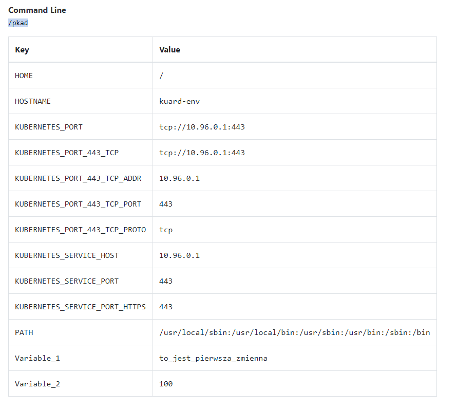

# Environment Variables - Ćwiczenia

## Korzystając z materiałów z lekcji przetestuj działania zmienne środowiskowe w praktyce.

### 1. Wykorzystaj proste zmienne środowiskowe

przykładowa definicja POD
```
apiVersion: v1
kind: Pod
metadata:
  creationTimestamp: null
  labels:
    run: kuard-env
  name: kuard-env
spec:
  containers:
  - image: poznajkubernetes/kuard
    name: kuard-env
    resources: {}
    env:
      - name: 'Variable_1'
        value: 'to_jest_pierwsza_zmienna'
      - name: 'Variable_2'
        value: '100'
  dnsPolicy: ClusterFirst
  restartPolicy: Never
status: {}
```

po wystartowaniu POD możemy zobaczyć że environment variables są widoczne w sekcji `environment`
```
> kubectl describe pod kuard-env

...
Containers:
  kuard-env:
    Container ID:   docker://99bed03dd7361e1d59110daeb4e5a6f3a120f59f773b6dcda983b14c9e7a91da
    Image:          poznajkubernetes/kuard
    Image ID:       docker-pullable://poznajkubernetes/kuard@sha256:230ff75987cf38d9d90ac1684d445f2d02f3edfa45865a0de35bc94f4a38c83b
    Port:           <none>
    Host Port:      <none>
    State:          Running
      Started:      Mon, 30 Dec 2019 09:36:34 +0100
    Ready:          True
    Restart Count:  0
    Environment:
      Variable_1:  to_jest_pierwsza_zmienna
      Variable_2:  100
    Mounts:
...
```

możemy też zobaczyć że zostaly poprawnie przekazane do aplikacji wew. kontenera



### Wykorzystaj w args zmienne środowiskowe


### Skorzystaj z możliwości przekazania informacji o pod poprzez zmienne środowiskowe