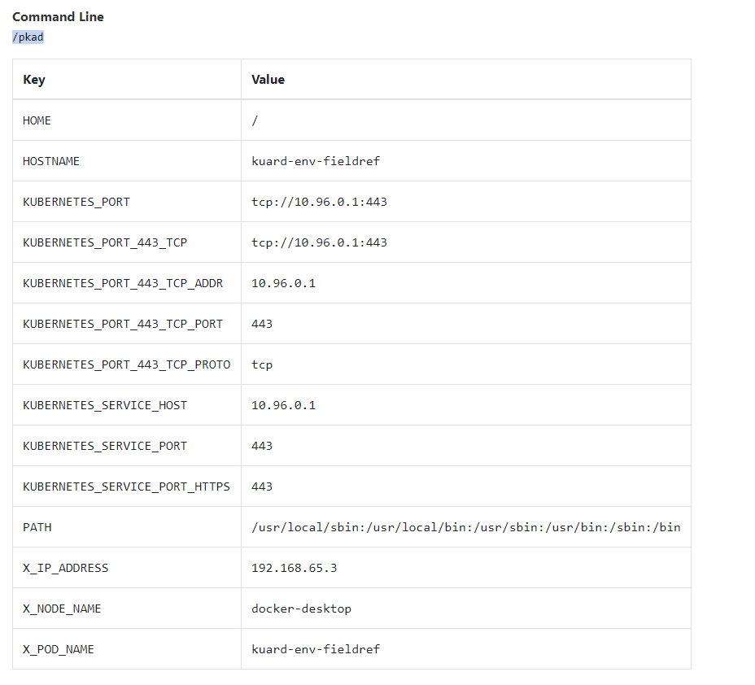

# Environment Variables - Ćwiczenia

## Korzystając z materiałów z lekcji przetestuj działania zmienne środowiskowe w praktyce.

### 1. Wykorzystaj proste zmienne środowiskowe

przykładowa definicja POD
```
apiVersion: v1
kind: Pod
metadata:
  creationTimestamp: null
  labels:
    run: kuard-env
  name: kuard-env
spec:
  containers:
  - image: poznajkubernetes/kuard
    name: kuard-env
    resources: {}
    env:
      - name: 'Variable_1'
        value: 'to_jest_pierwsza_zmienna'
      - name: 'Variable_2'
        value: '100'
  dnsPolicy: ClusterFirst
  restartPolicy: Never
status: {}
```

po wystartowaniu POD możemy zobaczyć że environment variables są widoczne w sekcji `environment`
```
> kubectl apply -f kuard-env.yml

pod/kuard-env created

> kubectl describe pod kuard-env

...
Containers:
  kuard-env:
    Container ID:   docker://99bed03dd7361e1d59110daeb4e5a6f3a120f59f773b6dcda983b14c9e7a91da
    Image:          poznajkubernetes/kuard
    Image ID:       docker-pullable://poznajkubernetes/kuard@sha256:230ff75987cf38d9d90ac1684d445f2d02f3edfa45865a0de35bc94f4a38c83b
    Port:           <none>
    Host Port:      <none>
    State:          Running
      Started:      Mon, 30 Dec 2019 09:36:34 +0100
    Ready:          True
    Restart Count:  0
    Environment:
      Variable_1:  to_jest_pierwsza_zmienna
      Variable_2:  100
    Mounts:
...
```

możemy też zobaczyć że zostaly poprawnie przekazane do aplikacji wew. kontenera


### 2. Wykorzystaj w args zmienne środowiskowe

przykładowa definicja POD
```
apiVersion: v1
kind: Pod
metadata:
  creationTimestamp: null
  labels:
    run: kuard-args
  name: kuard-args
spec:
  containers:
  - image: poznajkubernetes/kuard
    name: kuard-args
    resources: {}
    command: ['echo', 'Sprawdzmy czy $(Variable_1) i $(Variable_2) zostaną przekazane']
    env:
      - name: 'Variable_1'
        value: 'to_jest_pierwsza_zmienna'
      - name: 'Variable_2'
        value: '100'
  dnsPolicy: ClusterFirst
  restartPolicy: Never
status: {}
```

gry sprawdzimy logi POD po uruchomieniu widzimy że zmienne zostały poprawnie podmienione w argumentach komendy
```
> kubectl apply -f kuard-args.yml

pod/kuard-args created

> kubectl logs kuard-args

Sprawdzmy czy to_jest_pierwsza_zmienna i 100 zostaną przekazane
```

### 3. Skorzystaj z możliwości przekazania informacji o pod poprzez zmienne środowiskowe

przykładowa definicja POD
```
apiVersion: v1
kind: Pod
metadata:
  creationTimestamp: null
  labels:
    run: kuard-env-fieldref
  name: kuard-env-fieldref
spec:
  containers:
  - image: poznajkubernetes/kuard
    name: kuard-env
    resources: {}
    env:
      - name: 'X_POD_NAME'
        valueFrom:
          fieldRef:
            fieldPath: 'metadata.name'
      - name: 'X_IP_ADDRESS'
        valueFrom:
          fieldRef:
            fieldPath: 'status.hostIP'
      - name: 'X_NODE_NAME'
        valueFrom:
          fieldRef:
            fieldPath: 'spec.nodeName'
  dnsPolicy: ClusterFirst
  restartPolicy: Never
status: {}

```

po wystartowaniu POD możemy zobaczyć że environment variables są widoczne w sekcji `environment`, nie wszystkie natomiast są poprawnie wyświetlone.
```
> kubectl apply -f kuard-env-fieldref.yml

...
Containers:
  kuard-env:
    Container ID:   docker://2f00f9147073526bc0159d81dbc4dbca9f4f5f03cebac394fd3c9d13159f4a11
    Image:          poznajkubernetes/kuard
    Image ID:       docker-pullable://poznajkubernetes/kuard@sha256:230ff75987cf38d9d90ac1684d445f2d02f3edfa45865a0de35bc94f4a38c83b
    Port:           <none>
    Host Port:      <none>
    State:          Running
      Started:      Mon, 30 Dec 2019 10:18:12 +0100
    Ready:          True
    Restart Count:  0
    Environment:
      X_POD_NAME:    kuard-env-fieldref (v1:metadata.name)
      X_IP_ADDRESS:   (v1:status.hostIP)
      X_NODE_NAME:    (v1:spec.nodeName)
...
```


możemy za to zobaczyć że zostaly poprawnie przekazane do aplikacji wew. kontenera
